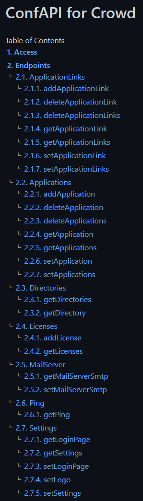

[](https://www.aservo.com/en/atlassian)

ConfAPI Commons
===============

[](https://maven-badges.herokuapp.com/maven-central/de.aservo/confapi-commons)
[](https://github.com/aservo/confapi-commons/actions/workflows/ci_main.yaml)
[](https://sonarcloud.io/dashboard?id=aservo_confapi-commons)
[](https://sonarcloud.io/dashboard?id=aservo_confapi-commons)
[](https://opensource.org/licenses/Apache-2.0)
[](http://makeapullrequest.com)

Library for common sources of the ConfAPI plugins:

* [ConfAPI for Jira](https://github.com/aservo/confapi-jira-plugin)
* [ConfAPI for Confluence](https://github.com/aservo/confapi-confluence-plugin)
* [ConfAPI for Bitbucket](https://github.com/aservo/confapi-bitbucket-plugin)
* [ConfAPI for Crowd](https://github.com/aservo/confapi-crowd-plugin)
* [ConfAPI for Fisheye / Crucible](https://github.com/aservo/confapi-fisheye-plugin)

---

## User guide

### What is ConfAPI?

Our ConfAPI Plugin is used to set the attributes:values for example the LookAndFeel settings like ContentText,
Button-color, etc. In this guide we will show you some examples with the endpoint `/settings`.

#### **How to read index.adoc** ?

- in the index.adoc you will find an automatic generated List of all our endpoints and will look like this:



- For our example we will check out **2.7 Settings** by clicking it
- Here you will find all methods for the selected Endpoint sorted by Name.
- we will take a look at **2.7.1 getLoginPage**
    - in this section you can find information about this specific `GET` request like:
        - a short description
        - Return type
        - and so on...

#### **How to send a request** ?

- How to get data
    - to get the data from  *2.7.1 getLoginPage* just select the `GET` method with following
      path `crowd/rest/confapi/1/settings/branding/login-page`
    - after you send the request successfully you will receive the content of the returned *
      SettingsBrandingLoginPageBean* and will look like this:

```json
{
  "showLogo": true,
  "header": "header",
  "content": "content",
  "buttonColor": "ffffff"
}
```

#### **How to set data**

- it is quite similar to set the content for the LoginPage. Now that we know how the object looks like we can rebuild it
  with our settings easily. First we change the Method to `PUT`, then we need to build a json object in our tool with
  the attributes that we want to change.

 ```json
{
  "showLogo": false,
  "header": "new header",
  "content": "new content",
  "buttonColor": "000000"
}
```

#### **Do I need to type all attributes everytime?**

No. if you just want to change the color, you just build the json object with the attribute:value for the color. our
addon will only change the color and keeps all other settings with the previous set values.


